# Proyecto 1 – CI/CD con GitHub Actions + Terraform + Docker
# Leonel Galetto y Justo Suárez Villalobos

## Resumen

Este proyecto implementa una aplicación Flask muy simple, containerizada con Docker, desplegada mediante un pipeline de GitHub Actions a una instancia en AWS gestionada con Terraform. 
Cada corrida en el pipeline que finaliza correctamente, actualiza la aplicación con la imagen más nueva.
Además, incluye monitoreo con Prometheus + Grafana y controles de seguridad en el pipeline (linter, tests, SBOM y Snyk).

## Componentes principales

- **Aplicación**: `app.py` (Flask) con:
  - Ruta `/` con mensaje de bienvenida.
  - Ruta `/health` para health-check.
  - Ruta `/metrics` exponiendo métricas en formato Prometheus mediante `prometheus_client`.
- **Tests**: `test_app.py` con pruebas de:
  - `/`
  - `/health`
  - `/metrics`
- **Dependencias**: `requirements.txt`
- **Contenedor**: `Dockerfile`
- **Monitoreo local**: `docker-compose.yml` + `monitoring/prometheus.yml`
- **Infraestructura**: `terraform/main.tf` + `terraform/vpc.tf` + `terraform/install_docker.sh`
- **Pipeline CI/CD**: `.github/workflows/main.yml`

## Fase 1: probar localmente.
### 1. Cómo ejecutar la app

```bash
# Crear y activar entorno virtual
python3 -m venv venv
source venv/bin/activate

pip install -r requirements.txt

# Ejecutar la app
python app.py
# La app quedará escuchando en http://localhost:5001
```
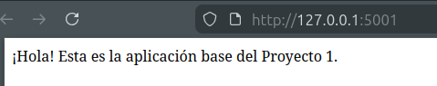

### 2. Ejecutar tests
En el mismo venv del paso 1:

```bash
pytest
```
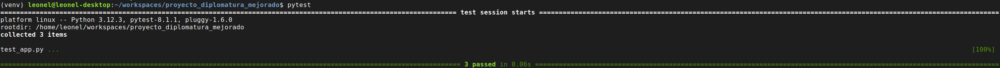

### 3. Construir y correr el contenedor localmente

```bash
# Construir la imagen
docker build -t proyecto-diplomatura:local .

# Correr el contenedor
docker run --rm -p 5001:5001 proyecto-diplomatura:local
```
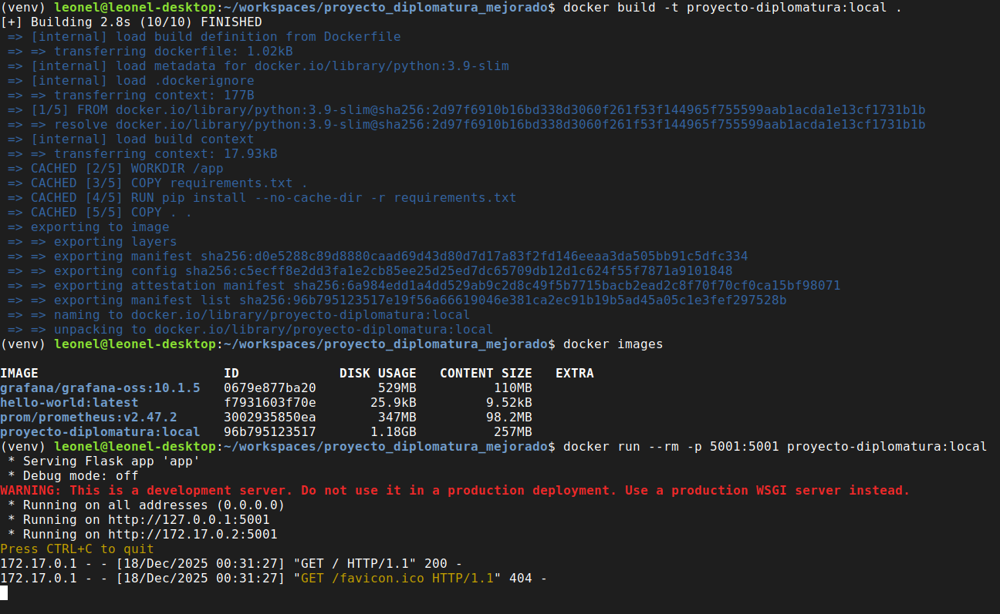

Luego podés acceder a:

- `http://localhost:5001/` → página principal
- `http://localhost:5001/health` → health-check
- `http://localhost:5001/metrics` → métricas Prometheus

### 4. Monitoreo con Prometheus + Grafana (local)

El archivo `docker-compose.yml` ya define los servicios:

- `prometheus` (puerto 9090)
- `grafana` (puerto 3000)

Para levantarlos:

```bash
docker-compose up -d
```
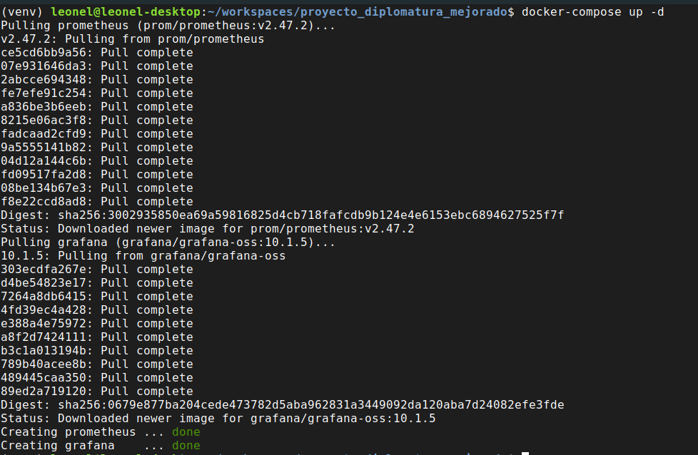

- Prometheus: http://localhost:9090
- Grafana: http://localhost:3000 (usuario/password por defecto: `admin` / `admin`)

La app Flask debe correr en el puerto 5001 para que Prometheus pueda scrapear `host.docker.internal:5001`.

## Fase 2: Levantar en la nube. Infraestructura con Terraform + AWS
### 1. Terraform 

En la carpeta `terraform/`:

- `main.tf`: define el proveedor AWS y una instancia EC2 (web_server) con Docker instalado.
- `install_docker.sh`: script que prepara el servidor con Docker.

Uso:

```bash
cd terraform

# Muestra el plan
terraform plan

# Inicializa la primera vez
terraform init

# Aplica los cambios
terraform apply
```

Una vez inicializado Terraform, corremos el comando de 'apply'. Al finalizar, Terraform va a mostrar:

- `public_ip`: IP pública del servidor (nos va a servir más adelante).
- `terraform_account_id`: ID de la cuenta AWS.


### 2. Pipeline CI/CD en GitHub Actions

El workflow principal está en `.github/workflows/main.yml` y tiene 3 etapas, pero antes necesitamos crear ciertas variables:
> **Importante:** para que el pipeline funcione, tenés que configurar estos *Secrets*
en tu repositorio de GitHub:
>
- `DOCKERHUB_USERNAME`
- `DOCKERHUB_TOKEN`
- `AWS_SERVER_IP` (usamos la que nos proveyó Terraform en el paso 1)
- `AWS_SERVER_USER`
- `AWS_SSH_PRIVATE_KEY`
- `SNYK_TOKEN` (para el job de seguridad. Previamente necesitamos crearnos un usuario)

1. **Job `probar-y-lintear` (CI)**  
   - Instala dependencias (`requirements.txt`).
   - Corre `flake8` para linting.
   - Corre `pytest`.

2. **Job `seguridad`**  
   - Genera un SBOM en formato CycloneDX (`sbom.json`).
   - Publica el SBOM como artefacto de workflow.
   - Ejecuta un escaneo con Snyk sobre las dependencias Python.

3. **Job `construir-y-desplegar` (CD)**  
   - Construye y pushea la imagen a Docker Hub.
   - Se conecta por SSH al servidor en AWS.
   - Crea/actualiza `monitoring/prometheus.yml`.
   - Crea/actualiza `docker-compose.yml` con:
     - Servicio `mi-app` (Flask).
     - Servicio `prometheus`.
     - Servicio `grafana`.
   - Ejecuta `docker-compose up -d`.

Dependencias entre jobs:

```yaml
probar-y-lintear  ->  seguridad  ->  construir-y-desplegar
```

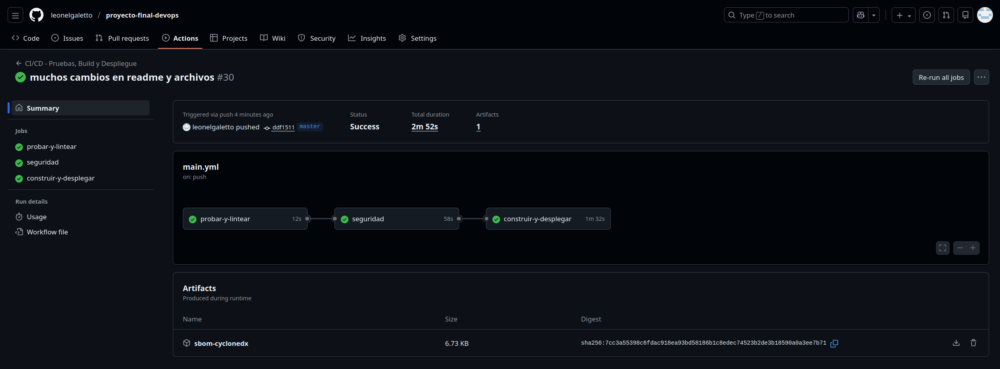

A partir de que pusheemos este pipeline y termine correctamente, vamos a poder ingresar a nuestros servicios en la nube.

http://public_ip -> aplicación principal

http://public_ip:9090 -> Prometheus

http://public_ip:3000 -> Grafana. (usuario/password por defecto: `admin` / `admin`)


### 3. Seguridad

La sección de seguridad del pipeline incluye:

- Linter (`flake8`) → buenas prácticas de código.
- Tests (`pytest`) → validación funcional.
- SBOM (CycloneDX) → inventario de dependencias en `sbom.json`.
- Snyk → análisis de vulnerabilidades en dependencias (SCA).

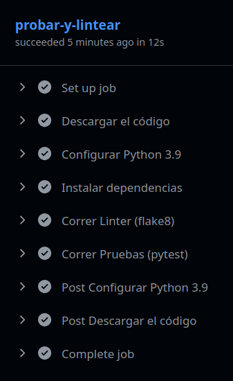
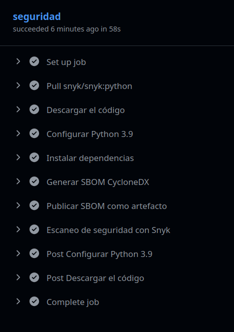
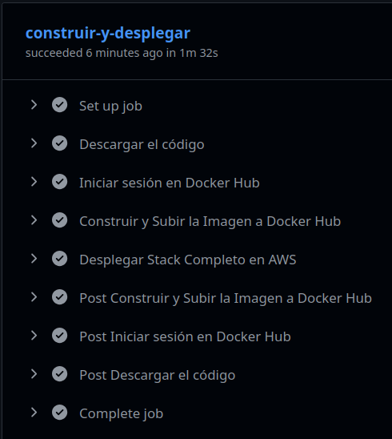

### 4. Monitoreo

Configurar por primera vez Grafana + Prometheus en la nube:

1. Loguearse en Grafana http://public_ip:3000
2. Vincular el datasource correcto a Grafana (en nuestro caso va a ser Prometheus). En http://public_ip:3000/connections/datasources/new y vamos a llenar el valor "Prometheus server URL" con http:public-ip:9090 (que es nuestro servicio de Prometheus). Apretar 'Save'.

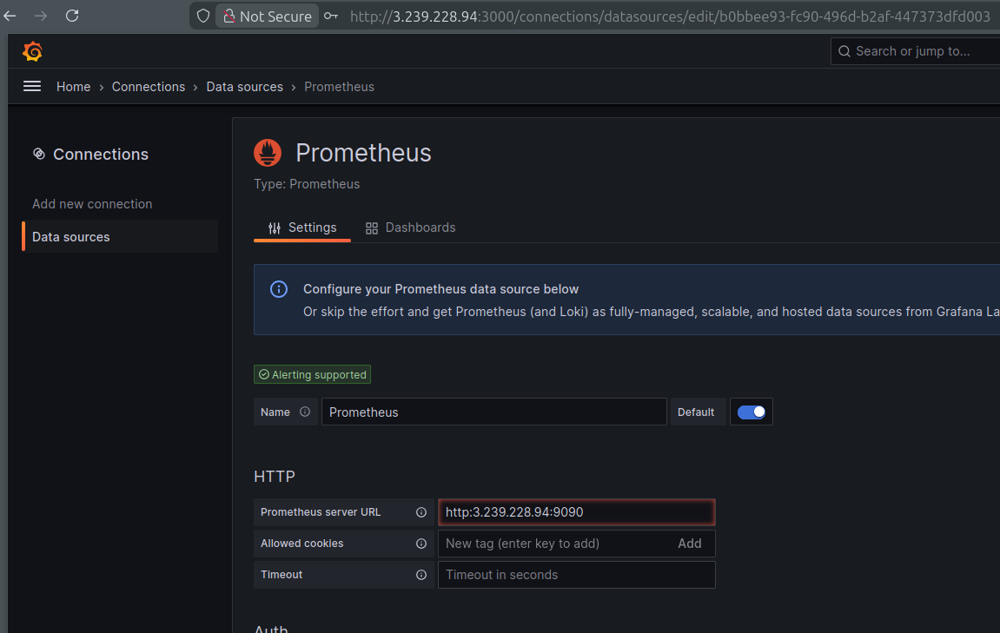

3. Armar un dashboard. Nosotros usamos un json preconfigurado y lo importamos (monitoring/dashboard.json) en http://public-ip:3000/dashboard/import .
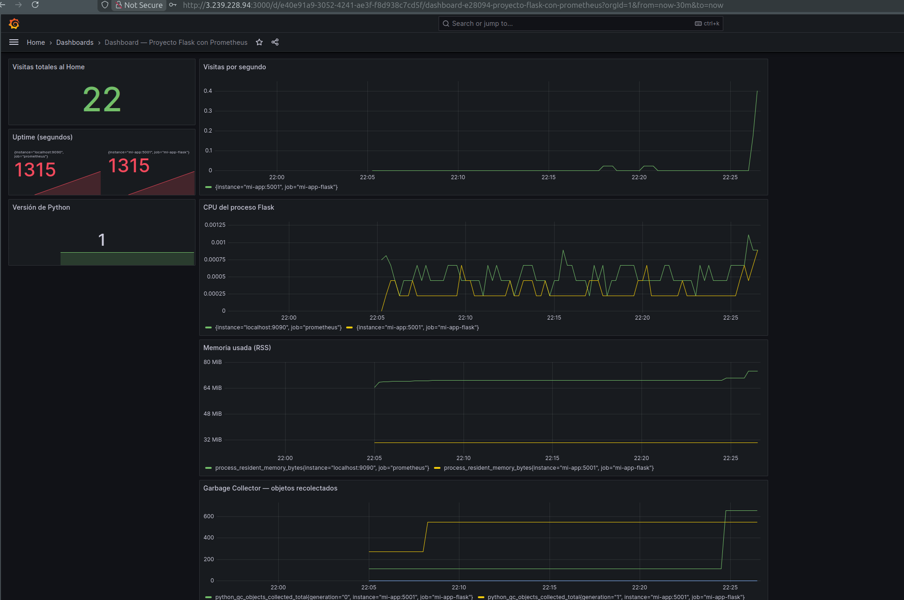

## Fase 3: Casos de prueba y validaciones funcionales

1. Linteo incorrecto: dejamos menos de 2 líneas en blanco antes de alguna función y pusheamos el cambio, esto genera un error de estilo.

    **EXPECTED**: el pipeline falla en la etapa 1 por flake8.

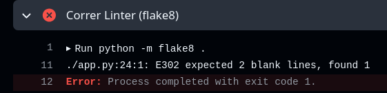
2. Test fallido: en lugar de esperar un 200, esperar otro resultado y pushear el cambio. 

    **EXPECTED**: el pipeline falla en la etapa 1 cuando quiere correr el test.

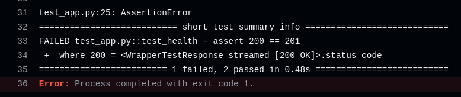

3. Versión de flask vieja: usar una versión de flask antigua, por ejemplo flask==2.0.3.

    **EXPECTED**: el pipeline falla en la etapa 1 por inconsistencias de funciones deprecadas.

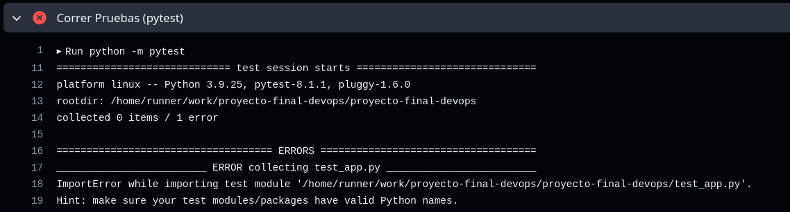

4. Vulnerabilidades en Snyk: poner una versión vulnerable en el 'requirements.txt', por ejemplo: setuptools==65.5.0, y pushear. 

    **EXPECTED**: el pipeline falla en la etapa 2

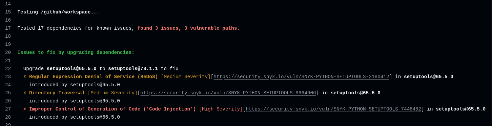

5. Validar las métricas en Grafana. Por ejemplo, entrar muchas veces a nuestra aplicación.

   **EXPECTED**: el contador de la métrica 'home_visits_counter' sube y se ve reflejado en el gráfico del dashboard.


## Info adicional
### Entrar por ssh al servidor y validar los servicios levantados
Para entrar por ssh a nuestra instancia en aws necesitamos: 
- Archivo .pem descargado en nuestra máquina, que es el key pair que creamos en AWS para validar nuestro ingress
- El nombre del usuario, en nuestro caso es 'ubuntu'
- La public_ip que nos proveyó Terraform en la fase 1.

Steps:
1) `ssh -i Downloads/mi-llave-aws.pem ubuntu@100.48.108.96` donde Downloads/mi-llave-aws.pem es el path donde se encuentra la llave, ubuntu es el user y 100.48.108.96 es la public_ip
2) Una vez ingresado, validar los servicios levantados con `docker ps`


## 4. Entregables según la consigna

- **Workflow GitHub Actions (.yml)**  
  - `.github/workflows/main.yml`

- **Archivos Terraform (.tf)**  
  - `terraform/main.tf`
  - `terraform/install_docker.sh`

- **Dockerfile e imagen**  
  - `Dockerfile` (imagen build/push desde el pipeline)

- **SBOM**  
  - `sbom.json` generado por el job de seguridad (publicado como artefacto).

- **Dashboard de métricas**  
  - Prometheus + Grafana via `docker-compose.yml` y `monitoring/prometheus.yml`.
  - Captura de pantalla a ser agregada al README por el alumno.

## 10. Cómo empaquetar para entregar

Desde la raíz del proyecto:

```bash
cd ..
zip -r "Proyecto1_EquipoX.zip" proyecto-diplomatura
```

Asegurate de incluir:
- Código fuente
- Terraform
- Dockerfile
- Workflow de GitHub Actions
- README
- Capturas de Prometheus/Grafana
